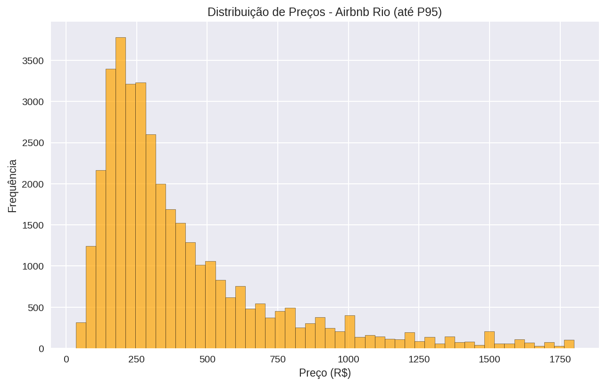
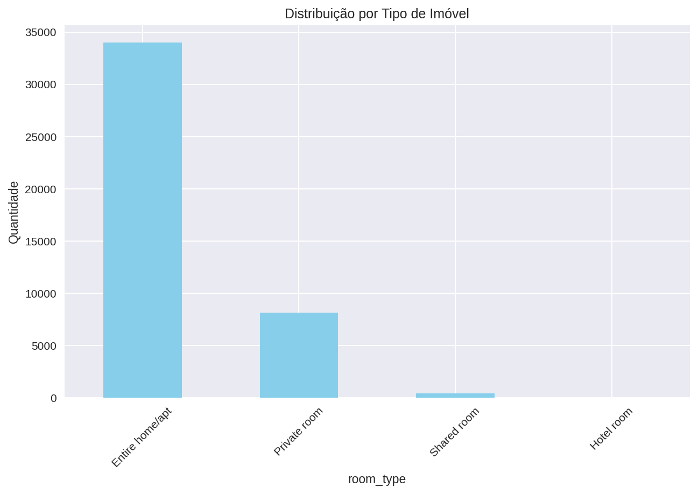
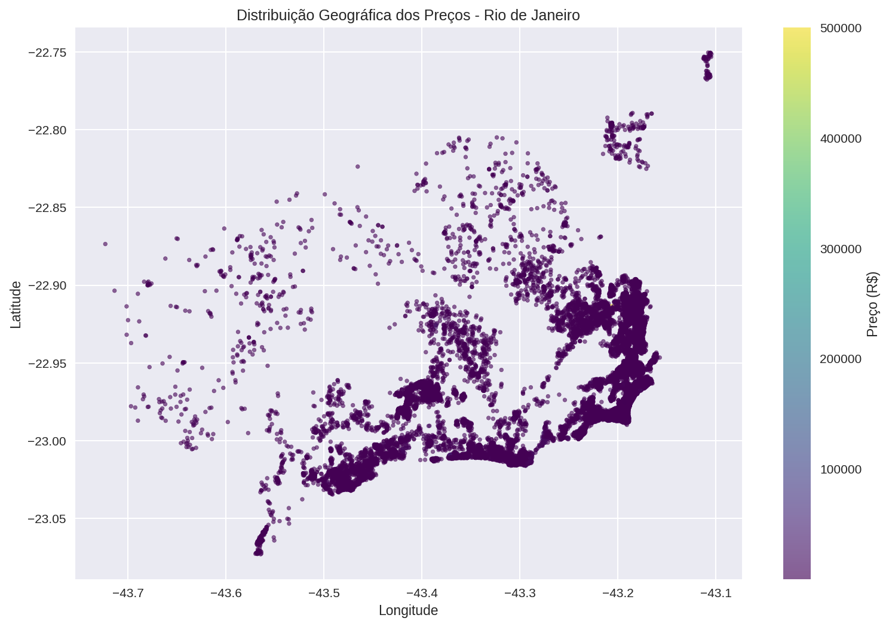
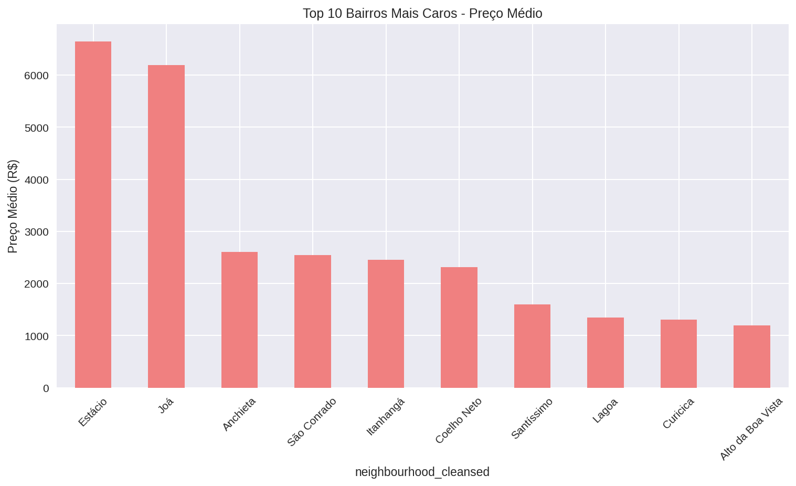

# Análise do Mercado Airbnb - Rio de Janeiro

## Sobre o Projeto

Análise exploratória completa do mercado de aluguel por temporada no Rio de Janeiro através da plataforma Airbnb. Este projeto investiga os fatores que influenciam os preços e fornece insights para anfitriões e viajantes.

## Objetivos

- Identificar os principais fatores que impactam o preço das diárias
- Analisar a distribuição geográfica dos imóveis e preços
- Descobrir padrões sazonais e de disponibilidade
- Fornecer recomendações baseadas em dados para precificação

## Tecnologias Utilizadas

- Python 3.9+
- Pandas - Manipulação de dados
- Matplotlib/Seaborn - Visualizações
- Jupyter Notebook - Análise interativa
- Plotly - Gráficos interativos

## Estrutura do Projeto
analise-airbnb-rio/
├── data/
│ ├── raw/listings.csv.gz # Dados originais
│ └── processed/
│ └── airbnb_rio_processed_super_light.csv # Dados processados
├── notebooks/
│ └── 01_eda_airbnb_rio.ipynb # Análise exploratória
├── src/
│ ├── data_cleaning.py # Funções de limpeza
│ ├── visualization.py # Funções de visualização
│ └── analysis.py # Funções de análise
├── reports/
│ └── relatorio_airbnb_rio.txt # Relatório executivo
├── images/ # Gráficos e visualizações
├── requirements.txt # Dependências do projeto
└── README.md

## Dataset

**Base de Dados:** Inside Airbnb - Rio de Janeiro  
**Período:** Dados mais recentes disponíveis  
**Amostra:** 42.572 imóveis analisados

### Dataset Processado
O arquivo `airbnb_rio_processed_super_light.csv` contém uma amostra representativa com as colunas mais relevantes:

- **Informações básicas:** id, neighbourhood_cleansed, room_type_simple
- **Capacidade:** accommodates, bedrooms
- **Preço:** price_clean, price_category
- **Localização:** latitude, longitude
- **Avaliações:** review_scores_rating, number_of_reviews
- **Host:** host_is_superhost

## Principais Análises

- Distribuição de preços e identificação de outliers
- Análise geográfica por bairros e regiões
- Impacto das comodidades no preço
- Segmentação por tipo de imóvel
- Relação entre avaliações e preços

## Resultados e Insights

### Visão Geral do Mercado
- Total de imóveis analisados: 42,572
- Preço médio: R$ 688.01
- Preço mediano: R$ 311.00
- Faixa de preço predominante: R$ 200 - R$ 558

### Distribuição por Tipo de Imóvel
- Entire home/apt: 33,990 imóveis (79.8%) - Preço médio: R$ 762
- Private room: 8,152 imóveis (19.1%) - Preço médio: R$ 392
- Shared room: 407 imóveis (1.0%) - Preço médio: R$ 194

### Top 5 Bairros Mais Caros
1. Joá: 155 imóveis - Média: R$ 6.186 - Mediana: R$ 5.000
2. São Conrado: 364 imóveis - Média: R$ 2.548 - Mediana: R$ 754
3. Itanhangá: 179 imóveis - Média: R$ 2.457 - Mediana: R$ 352
4. Lagoa: 264 imóveis - Média: R$ 1.350 - Mediana: R$ 630
5. Gávea: 220 imóveis - Média: R$ 1.044 - Mediana: R$ 450

### Fatores que Impactam o Preço
- Capacidade média: 3.9 pessoas
- Quartos mais comuns: 1 quarto (24,895 imóveis)
- Comodidades mais populares:
  - Wi-Fi: 40,829 imóveis (95.9%)
  - Ar condicionado: 31,954 imóveis (75.1%)
  - Estacionamento: 25,212 imóveis (59.2%)
  - Piscina: 10,209 imóveis (24.0%)

## Visualizações Principais

### Distribuição de Preços


### Tipos de Imóvel


### Análise Geográfica


### Bairros Mais Caros


## Código Fonte (src/)

Scripts Python modulares para reproduzir a análise:

### data_cleaning.py
- `load_and_clean_data()` - Carrega e limpa os dados
- `get_missing_data_summary()` - Análise de dados missing
- `remove_price_outliers()` - Remove outliers de preço

### visualization.py  
- `plot_price_distribution()` - Gráfico de distribuição de preços
- `plot_room_type_analysis()` - Análise por tipo de imóvel
- `plot_geographic_prices()` - Mapa geográfico

### analysis.py
- `get_price_statistics()` - Estatísticas de preços
- `get_neighborhood_analysis()` - Análise por bairro
- `generate_executive_summary()` - Resumo executivo

**Exemplo de uso:**
```python
from src.data_cleaning import load_and_clean_data
from src.analysis import get_price_statistics

df = load_and_clean_data('data/raw/listings.csv.gz')
stats = get_price_statistics(df)
print(stats)

## Relatórios e Documentação

### Relatório Executivo
- [relatorio_airbnb_rio.txt](reports/relatorio_airbnb_rio.txt) - Análise completa com insights e recomendações

**Principais seções:**
- Resumo executivo
- Descobertas principais  
- Top bairros por preço
- Recomendações estratégicas
- Próximos passos

## Como Executar

1. Clone o repositório:
```bash
git clone https://github.com/Matheus-Diniz-Silva/analise-airbnb-rio.git

2. Instale as dependências:
```bash
pip install -r requirements.txt

3. Execute o Jupyter Notebook:
```bash
jupyter notebook notebooks/01_eda_airbnb_rio.ipynb

## Insights Principais

1. **Mercado Bifurcado:** Grande diferença entre preço médio (R$ 688) e mediano (R$ 311)
2. **Concentração Geográfica:** Copacabana domina com 31% dos imóveis
3. **Luxo Concentrado:** Bairros como Joá e São Conrado têm preços 8x maiores que a mediana
4. **Tipologia Predominante:** Apartamentos/casas inteiras representam 80% do mercado
5. **Comodidades Básicas:** Wi-Fi presente em 96% dos imóveis, ar condicionado em 75%

## Recomendações para Anfitriões

- Precificar competitivamente: Focar na mediana de R$ 311, não na média
- Investir em comodidades essenciais: Wi-Fi e ar condicionado são esperados
- Buscar superhost: Aumenta visibilidade e número de reviews
- Considerar localização: Bairros menos saturados podem oferecer melhor custo-benefício

## Próximos Passos para Análise

1. Análise de sazonalidade e disponibilidade
2. Segmentação por público-alvo (família, casal, trabalho)
3. Análise de concorrência por bairro
4. Modelo preditivo de preços

## Contato

Matheus Diniz - [LinkedIn](https://www.linkedin.com/in/matheusdinizsilva/) - matheus.dinizbrito@gmail.com

[](https://www.linkedin.com/in/matheusdinizsilva/)
